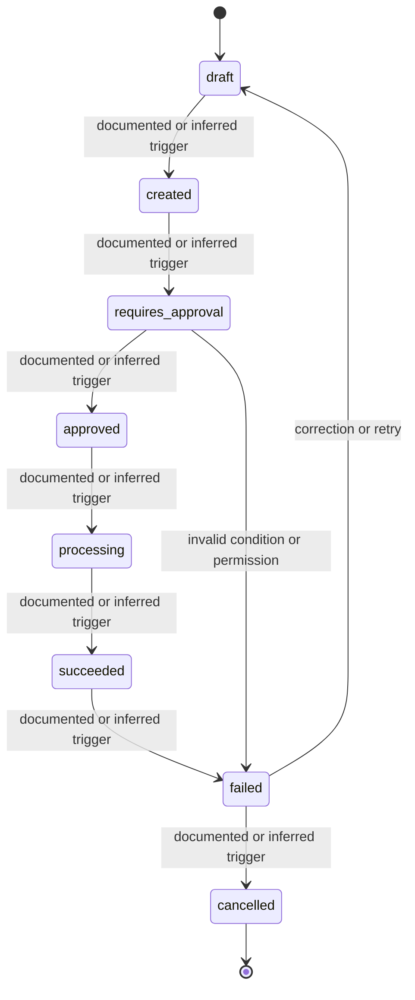

# State Model — PaymentBehaviorModel

## Purpose

This file makes lifecycle behavior explicit. It separates a listed status from a modeled transition.

A status name is not enough. A useful state model must identify:

- entry trigger;
- exit trigger;
- actor;
- visibility;
- allowed next states;
- invalid transitions;
- exception paths.

## State diagram

## Transition audit table

| From state | To state | Required trigger | Actor / system | Documentation check |
|---|---|---|---|---|
| `draft` | `created` | Must be explicit | Finance user / system | Verify trigger, timing, and visibility. |
| `created` | `requires_approval` | Must be explicit | Finance user / system | Verify trigger, timing, and visibility. |
| `requires_approval` | `approved` | Must be explicit | Finance user / system | Verify trigger, timing, and visibility. |
| `approved` | `processing` | Must be explicit | Finance user / system | Verify trigger, timing, and visibility. |
| `processing` | `succeeded` | Must be explicit | Finance user / system | Verify trigger, timing, and visibility. |
| `succeeded` | `failed` | Must be explicit | Finance user / system | Verify trigger, timing, and visibility. |
| `failed` | `cancelled` | Must be explicit | Finance user / system | Verify trigger, timing, and visibility. |

## Invalid transition checks

The documentation should explicitly indicate whether these cases are impossible, blocked, or handled through an exception path:

- action attempted by the wrong role;
- action attempted in the wrong state;
- action attempted before dependency readiness;
- action repeated after completion;
- action performed in a different environment or version.
