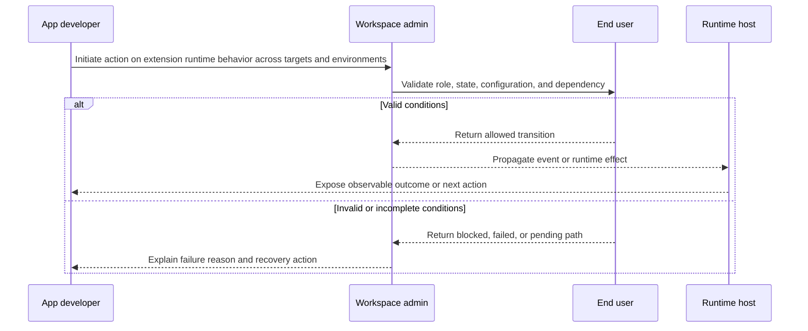

# Sequence Diagram — Atlassian

## Purpose

This diagram shows the operational path across actors and system components. It is used to detect missing ordering rules, invisible dependencies, and unclear response handling.

## Audit questions

- Is the first required action explicit?
- Is the validation point visible?
- Is the success path separated from the failure path?
- Is asynchronous behavior documented?
- Is the next action observable for the right role?
- Is the downstream effect documented in the same workflow?
