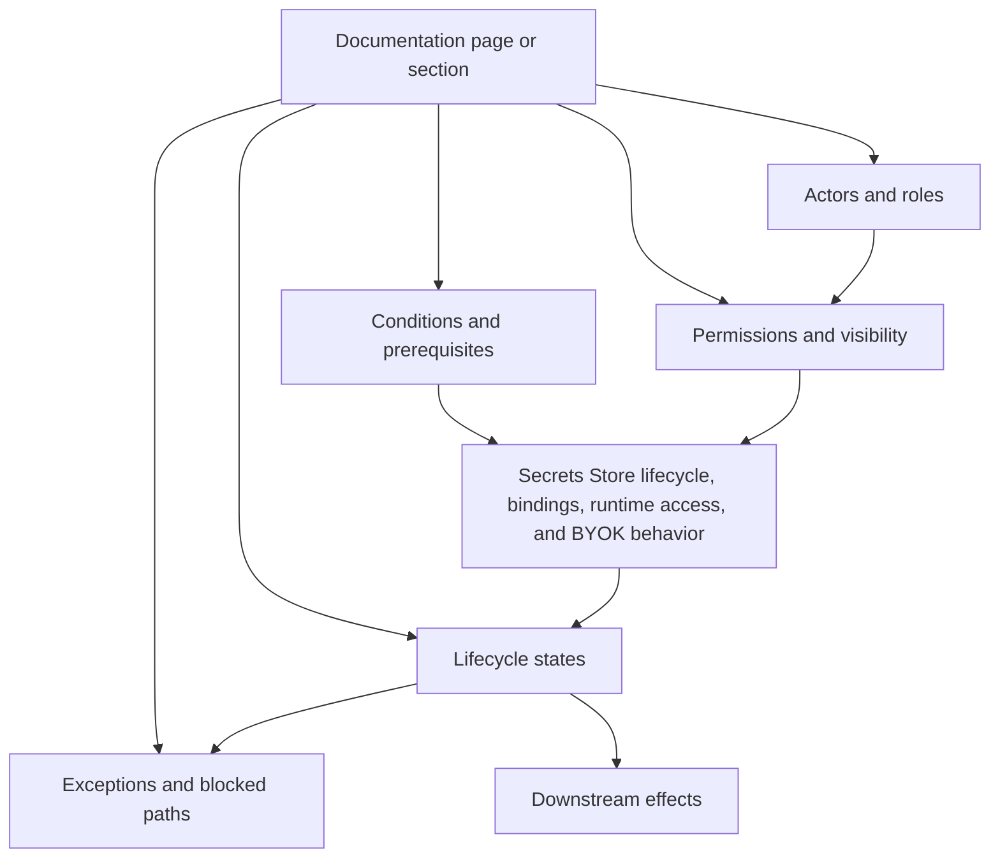

# Concept Map — Cloudflare

## Core model

```text
actor + permission + secret state + integration + environment
```

## Concept map



## Dependency list

- Secrets Store lifecycle, bindings, runtime access, and BYOK behavior
- actors
- roles / permissions
- states
- conditions
- exceptions
- dependencies
- downstream effects

## Audit use

The map is used to check whether the documentation explains concepts as connected behavior or as isolated vocabulary.
