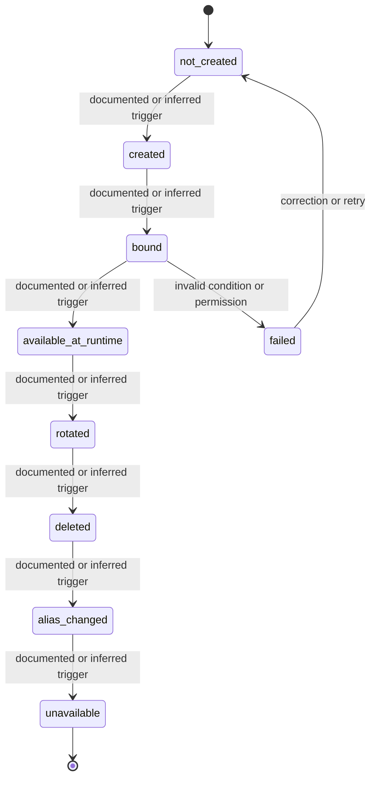

# State Model — Cloudflare

## Purpose

This file makes lifecycle behavior explicit. It separates a listed status from a modeled transition.

A status name is not enough. A useful state model must identify:

- entry trigger;
- exit trigger;
- actor;
- visibility;
- allowed next states;
- invalid transitions;
- exception paths.

## State diagram

## Transition audit table

| From state | To state | Required trigger | Actor / system | Documentation check |
|---|---|---|---|---|
| `not_created` | `created` | Must be explicit | Account admin / system | Verify trigger, timing, and visibility. |
| `created` | `bound` | Must be explicit | Account admin / system | Verify trigger, timing, and visibility. |
| `bound` | `available_at_runtime` | Must be explicit | Account admin / system | Verify trigger, timing, and visibility. |
| `available_at_runtime` | `rotated` | Must be explicit | Account admin / system | Verify trigger, timing, and visibility. |
| `rotated` | `deleted` | Must be explicit | Account admin / system | Verify trigger, timing, and visibility. |
| `deleted` | `alias_changed` | Must be explicit | Account admin / system | Verify trigger, timing, and visibility. |
| `alias_changed` | `unavailable` | Must be explicit | Account admin / system | Verify trigger, timing, and visibility. |

## Invalid transition checks

The documentation should explicitly indicate whether these cases are impossible, blocked, or handled through an exception path:

- action attempted by the wrong role;
- action attempted in the wrong state;
- action attempted before dependency readiness;
- action repeated after completion;
- action performed in a different environment or version.
