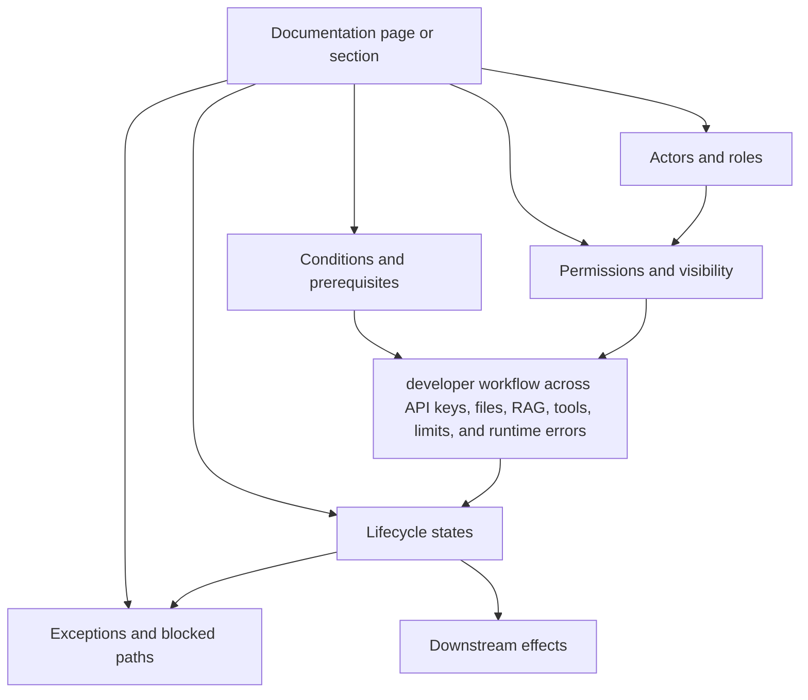

# Concept Map — Mistral AI

## Core model

```text
workspace + API key + endpoint + tool/RAG/file configuration + limit state
```

## Concept map



## Dependency list

- developer workflow across API keys, files, RAG, tools, limits, and runtime errors
- actors
- roles / permissions
- states
- conditions
- exceptions
- dependencies
- downstream effects

## Audit use

The map is used to check whether the documentation explains concepts as connected behavior or as isolated vocabulary.
