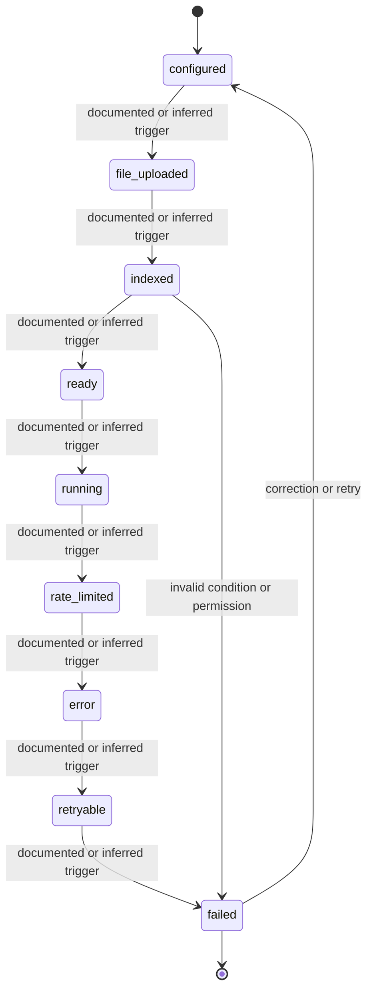

# State Model — Mistral AI

## Purpose

This file makes lifecycle behavior explicit. It separates a listed status from a modeled transition.

A status name is not enough. A useful state model must identify:

- entry trigger;
- exit trigger;
- actor;
- visibility;
- allowed next states;
- invalid transitions;
- exception paths.

## State diagram

## Transition audit table

| From state | To state | Required trigger | Actor / system | Documentation check |
|---|---|---|---|---|
| `configured` | `file_uploaded` | Must be explicit | Developer / system | Verify trigger, timing, and visibility. |
| `file_uploaded` | `indexed` | Must be explicit | Developer / system | Verify trigger, timing, and visibility. |
| `indexed` | `ready` | Must be explicit | Developer / system | Verify trigger, timing, and visibility. |
| `ready` | `running` | Must be explicit | Developer / system | Verify trigger, timing, and visibility. |
| `running` | `rate_limited` | Must be explicit | Developer / system | Verify trigger, timing, and visibility. |
| `rate_limited` | `error` | Must be explicit | Developer / system | Verify trigger, timing, and visibility. |
| `error` | `retryable` | Must be explicit | Developer / system | Verify trigger, timing, and visibility. |
| `retryable` | `failed` | Must be explicit | Developer / system | Verify trigger, timing, and visibility. |

## Invalid transition checks

The documentation should explicitly indicate whether these cases are impossible, blocked, or handled through an exception path:

- action attempted by the wrong role;
- action attempted in the wrong state;
- action attempted before dependency readiness;
- action repeated after completion;
- action performed in a different environment or version.
