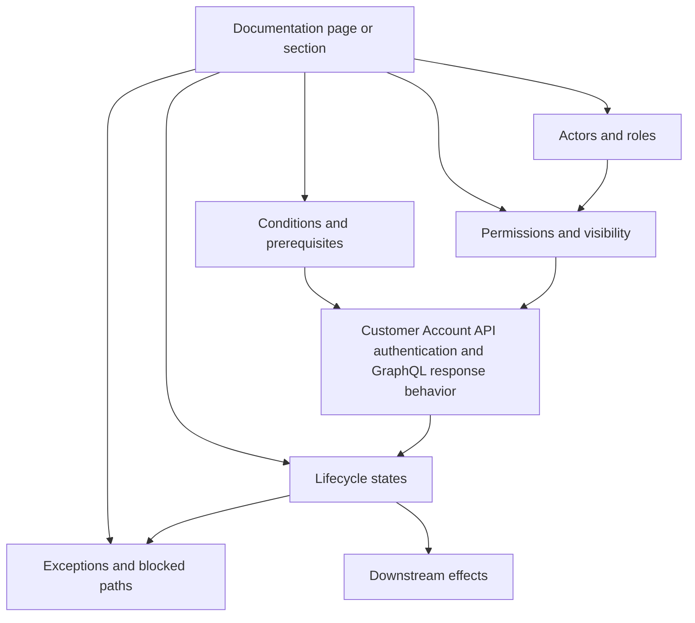

# Concept Map — Shopify

## Core model

```text
client type + discovery endpoint + auth parameters + token exchange + GraphQL response pattern
```

## Concept map



## Dependency list

- Customer Account API authentication and GraphQL response behavior
- actors
- roles / permissions
- states
- conditions
- exceptions
- dependencies
- downstream effects

## Audit use

The map is used to check whether the documentation explains concepts as connected behavior or as isolated vocabulary.
