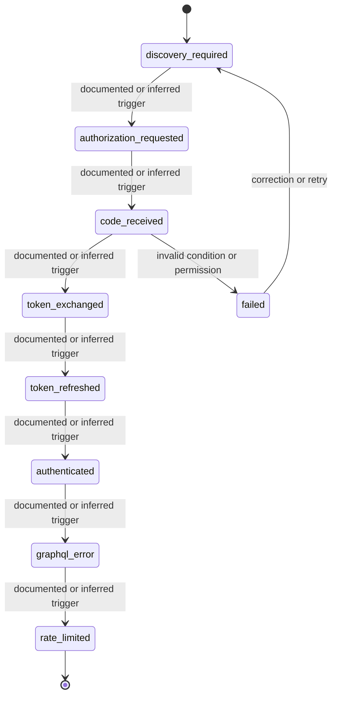

# State Model — Shopify

## Purpose

This file makes lifecycle behavior explicit. It separates a listed status from a modeled transition.

A status name is not enough. A useful state model must identify:

- entry trigger;
- exit trigger;
- actor;
- visibility;
- allowed next states;
- invalid transitions;
- exception paths.

## State diagram

## Transition audit table

| From state | To state | Required trigger | Actor / system | Documentation check |
|---|---|---|---|---|
| `discovery_required` | `authorization_requested` | Must be explicit | Storefront developer / system | Verify trigger, timing, and visibility. |
| `authorization_requested` | `code_received` | Must be explicit | Storefront developer / system | Verify trigger, timing, and visibility. |
| `code_received` | `token_exchanged` | Must be explicit | Storefront developer / system | Verify trigger, timing, and visibility. |
| `token_exchanged` | `token_refreshed` | Must be explicit | Storefront developer / system | Verify trigger, timing, and visibility. |
| `token_refreshed` | `authenticated` | Must be explicit | Storefront developer / system | Verify trigger, timing, and visibility. |
| `authenticated` | `graphql_error` | Must be explicit | Storefront developer / system | Verify trigger, timing, and visibility. |
| `graphql_error` | `rate_limited` | Must be explicit | Storefront developer / system | Verify trigger, timing, and visibility. |

## Invalid transition checks

The documentation should explicitly indicate whether these cases are impossible, blocked, or handled through an exception path:

- action attempted by the wrong role;
- action attempted in the wrong state;
- action attempted before dependency readiness;
- action repeated after completion;
- action performed in a different environment or version.
