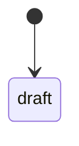
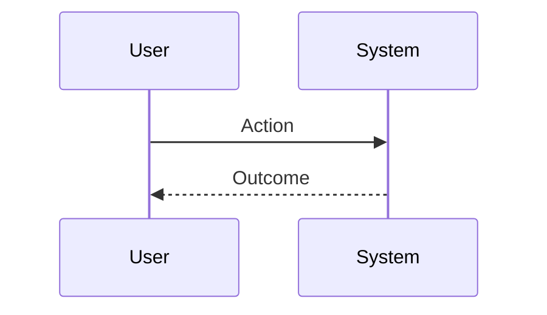

# Behavioral Audit Template

## Object

## Source pages

## Core concept

## Workflow

## Roles

## States

## Conditions

## Exceptions

## Dependencies

## Version / environment

## Localization / terminology

## Behavior model

```text
actor + condition + state + dependency -> action -> outcome -> next action
```

## State diagram



## Sequence diagram



## Findings

| Finding | Evidence | Impact | Recommendation |
|---|---|---|---|

